# 📸 Project Image Gallery

This visual gallery highlights key artifacts and infrastructure states from the **Secure Banking CI/CD Pipeline**.

## 🚀 CI/CD Workflows
### SonarCloud Scan
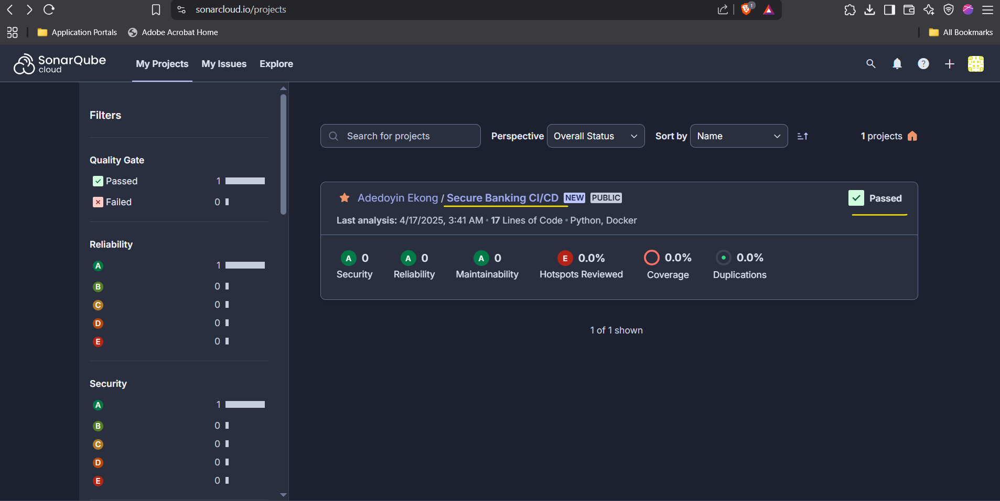

### Staging Deployment Success
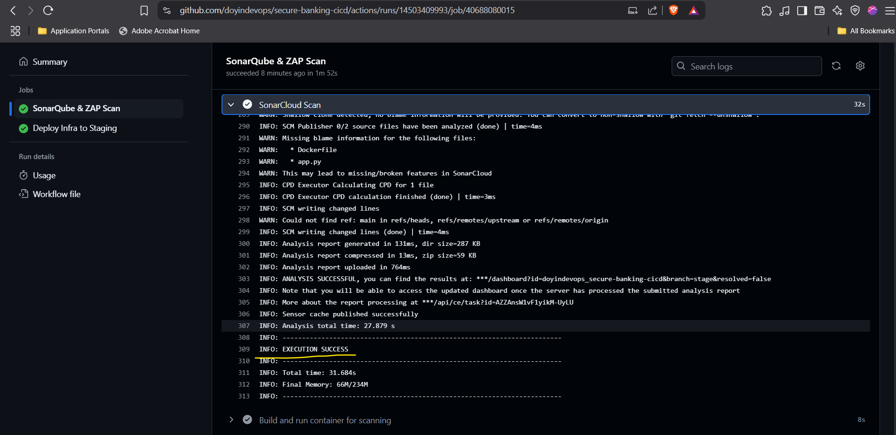

### Terraform Apply (Staging)
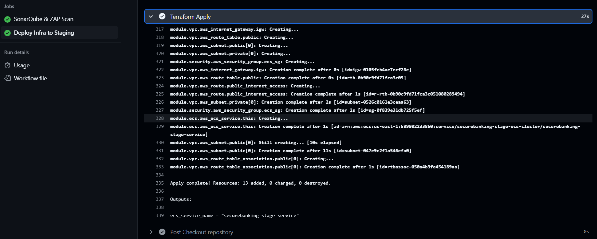

### Task Overview (Fargate)
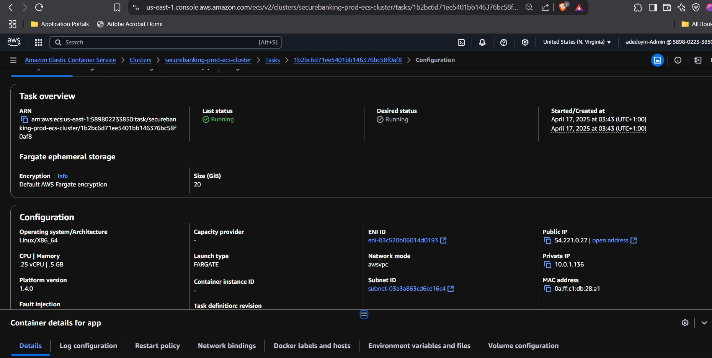

### Running Task
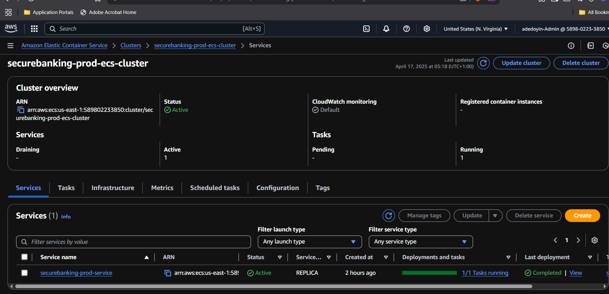

---

## 🛠️ Infrastructure & Services (AWS)
### DockerHub Repository
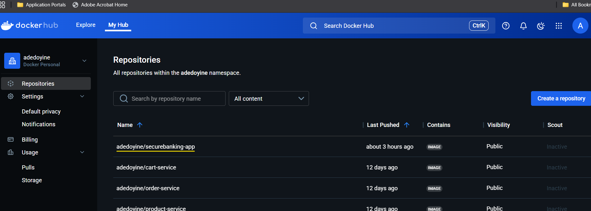

### S3 Bucket
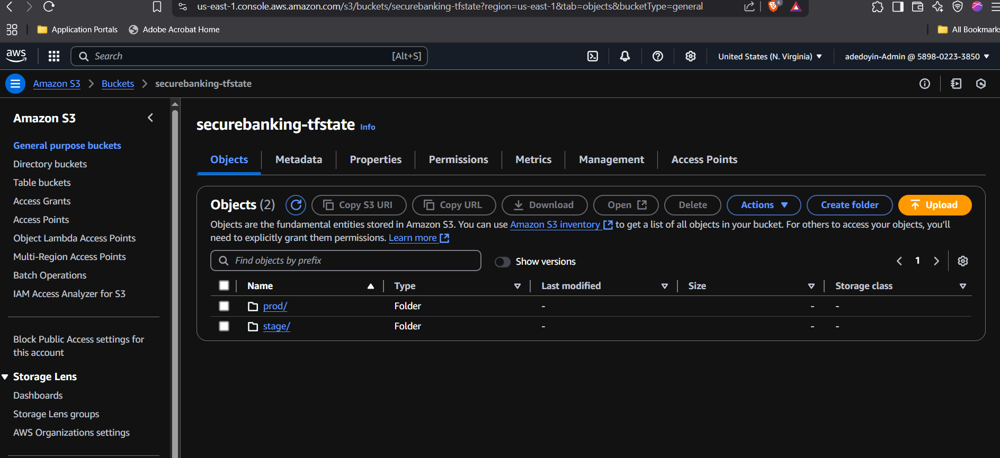

### DynamoDB Table
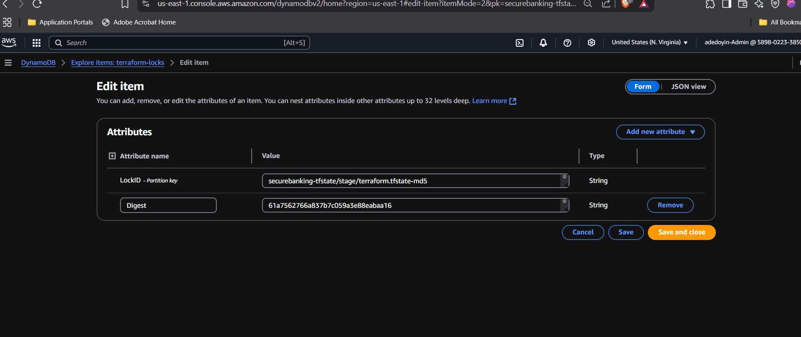

### Terraform Lock Table
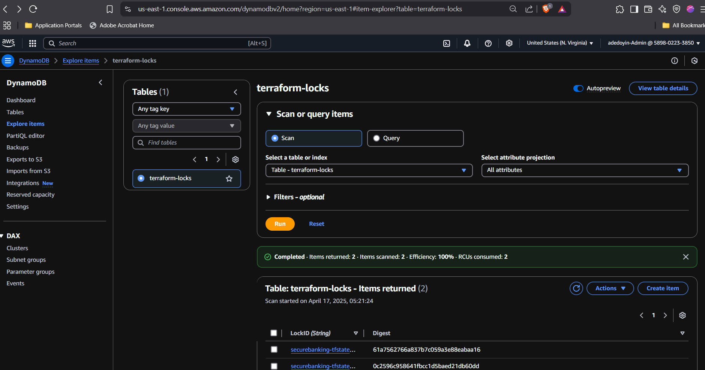

### DynamoDB View
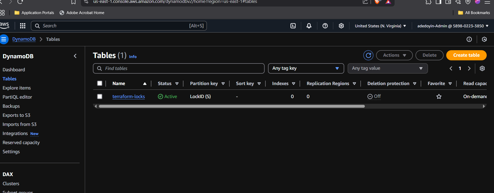

### Slack Notification
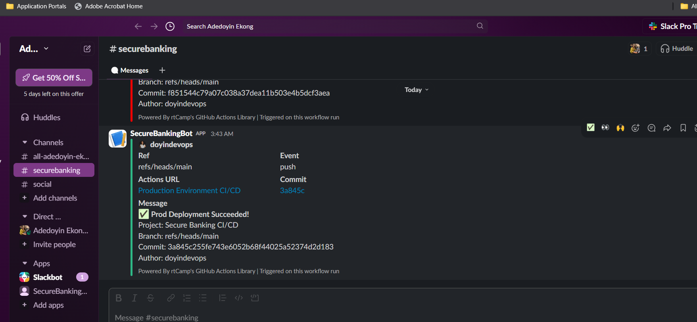

### ECS Clusters
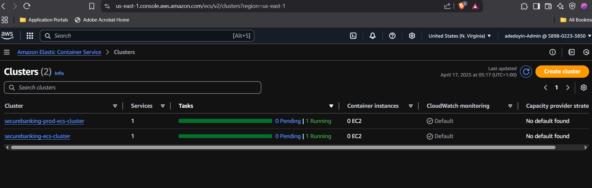

### Dev Deployment Logs
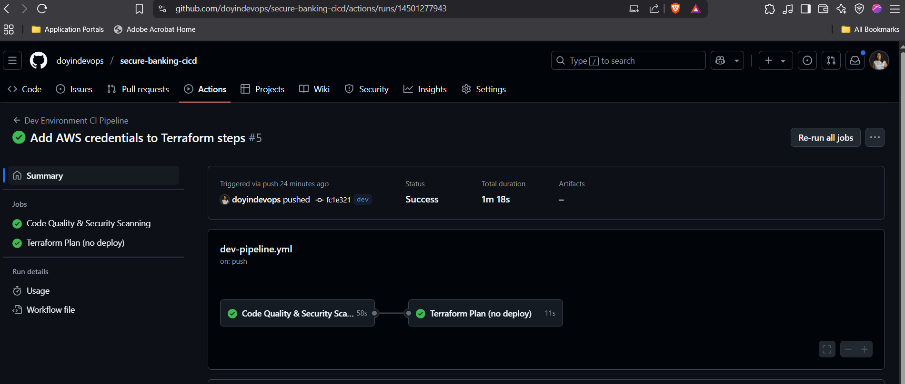

---

## 🧭 Project Blueprint
### Prod Deployment Success
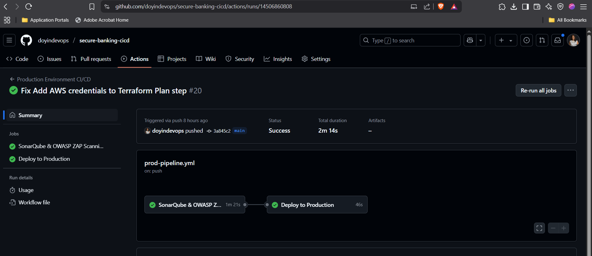

### CI/CD Architecture Overview
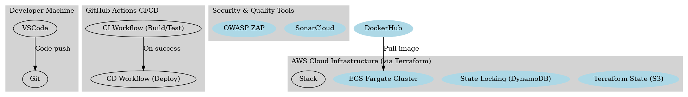

